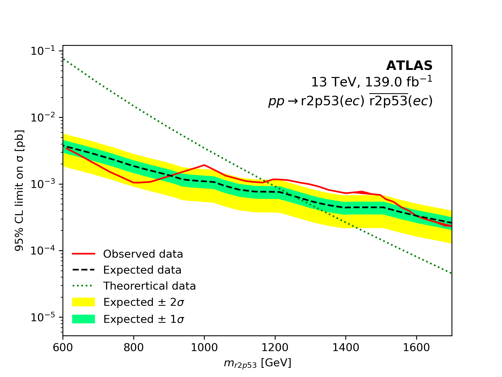
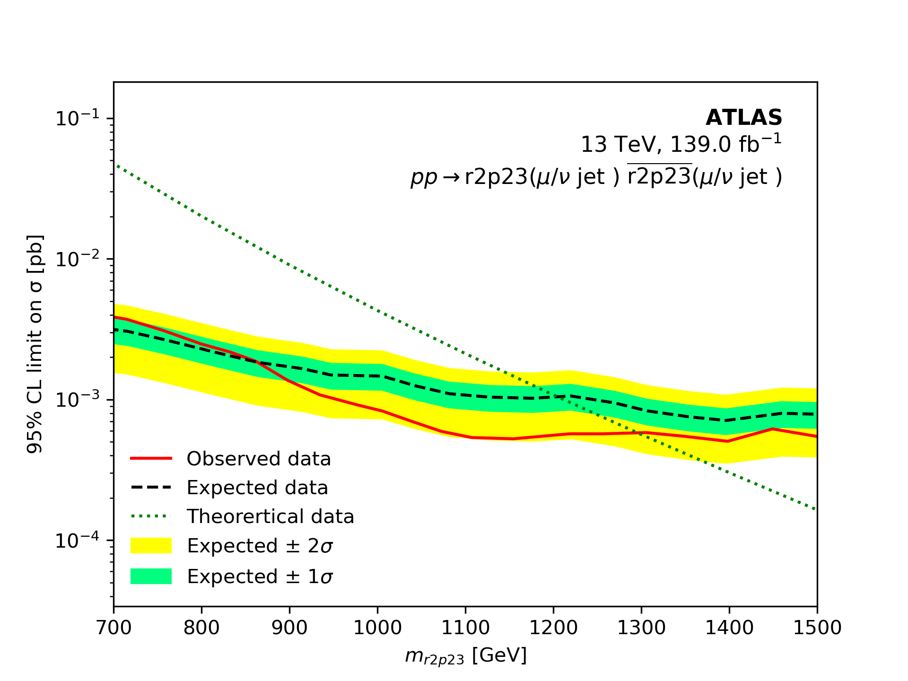

# MadGraph Results

The scalar leptoquark pair–production cross-sections were generated in **MG5_aMC v3.6.3** with the UFO model `SLQrules`.  
For each scan, only a single Yukawa coupling was switched on, and the leptoquark mass parameter was varied between ~0.6–1.8 TeV.  
The resulting cross-sections were compared with the 95% CL ATLAS limits (139 fb⁻¹, 13 TeV).
He we have not decayed the particle in to desired state but turned on the Yukawa to see any effect inthe pair production. Since $\Pi_7$ is triplet in SU(3), it is QCD dominated at production cross section.

---

## Results

- **$r2p53$ (ec), $y_{12}$ on**  
  
  → Observed (red), Expected (black dashed), bands (green/yellow), Theory (green dotted).  
  → Exclusion pushes the mass bound to about **~1.2 TeV**.

- **$r2p23$ (μν jet), $y_{22}$ on**  
 
  → Same plotting convention.  
  → Mass bound around **~1.3 TeV**.

---

These plots demonstrate how different Yukawa structures shift the exclusion, with theory predictions crossing the ATLAS 95% CL curves at different mass ranges.
## Comparison
We can clearly see that for the charge $2/3$ in $y_{22}$, the lower mass bound is much higher than charge $5/3$ in $y_{12}$. The possible estimation is beacause of the high sesitivty in electron chalorimeter, background effects are also mildly contributing in this electron production making high luminosity capared to expected line.

