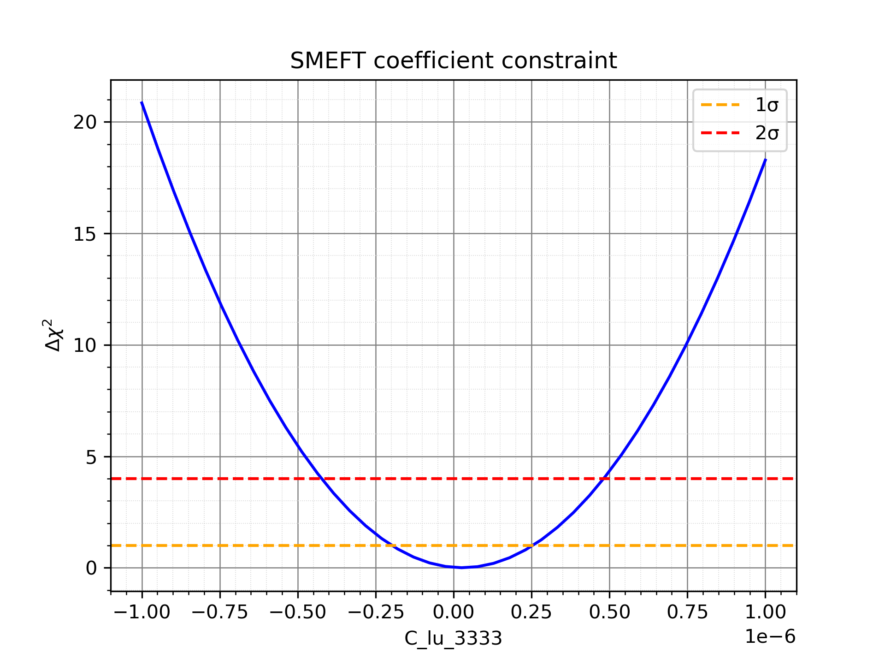
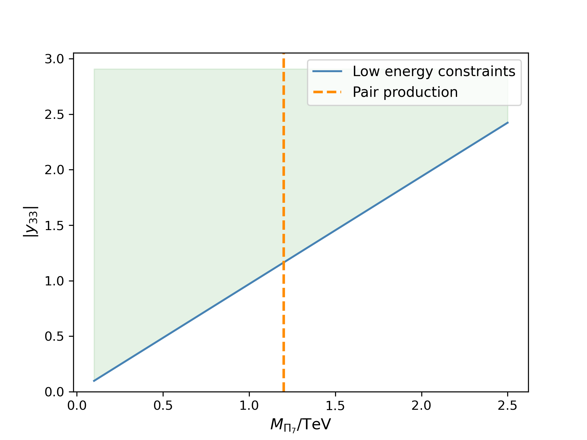

# Wilson Coefficients — SMEFT Fits

In the SMEFT framework, heavy new particles such as scalar leptoquarks generate
higher-dimensional operators once integrated out.  
Each operator O_i comes with a **Wilson coefficient** C_i which measures
the strength of the new interaction relative to the scale Λ:

    $L_SMEFT = L_SM + Σ (C_i / Λ²) * O_i$

- O_i: effective operator built from SM fields  
- C_i: Wilson coefficient (dimensionless, encodes new physics)  
- Λ: scale of new physics  

---

## Chi² Scan for Wilson Coefficient

*Chi² profile for C_lu^1133.  
The intersections with the 1σ (orange) and 2σ (red) lines give the allowed range
of this coefficient compared to the Standard Model prediction.*

---

## Yukawa–Mass Parameter Space

*Allowed region in the (|y_33|, M_Pi7) plane.  
The blue contour shows low-energy SMEFT constraints, while the orange dashed
line indicates the collider pair-production bound. The overlap defines the
viable parameter space for the scalar leptoquark.*

---

📌 **Note:** Only results are shown here. Full scan tables and scripts are
kept local and will be added later if needed.
